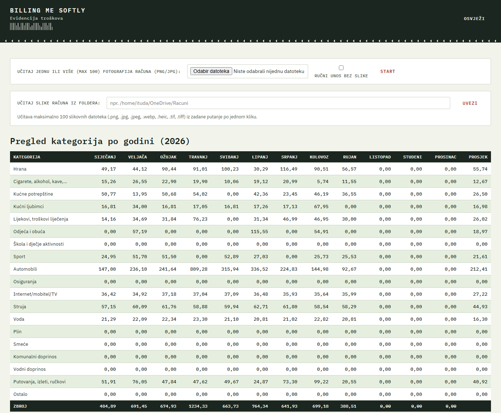
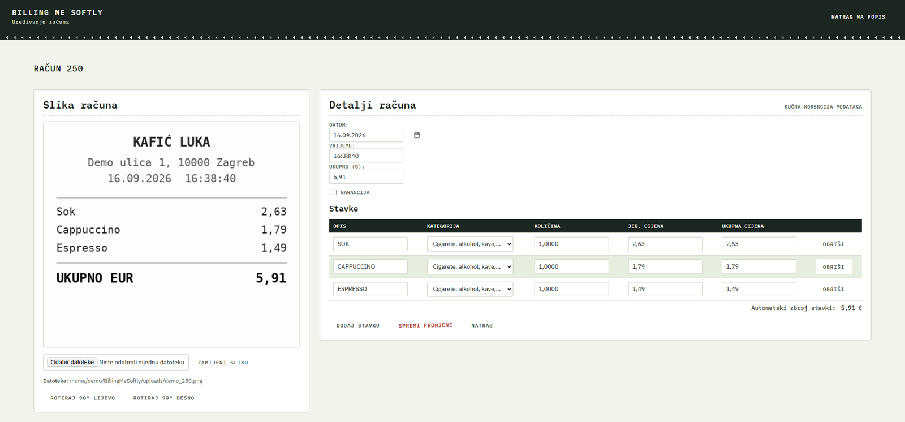
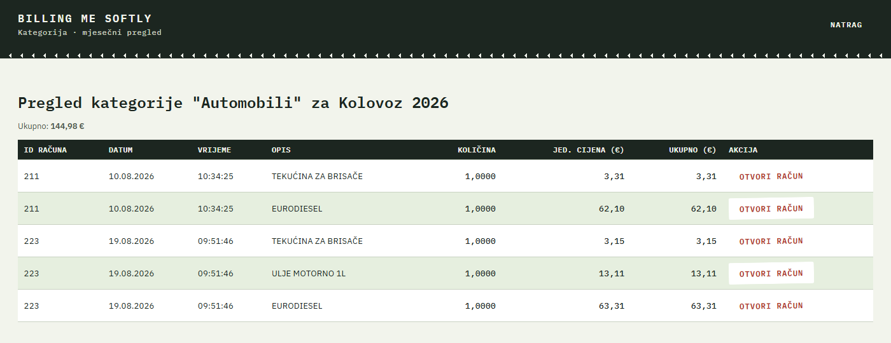

# Billing Me Softly

**Self-hosted receipt scanner and expense tracker.** Snap a photo of a receipt, let Google Gemini Vision read it, review the result, and see where your money goes, by category and month. Runs on Windows, Linux and macOS, and keeps all your data in a local SQLite file.




> Built for Croatian receipts: the UI and OCR prompts are in Croatian and amounts are in EUR. The screenshots above use fictional demo data.
>
> *Kratko na hrvatskom:* Billing Me Softly je aplikacija za evidenciju kućnih troškova. Slikaš račun, Google Gemini Vision prepozna stavke, cijene i kategorije, ti ih pregledaš i ispraviš, a aplikacija prikazuje potrošnju po kategorijama i mjesecima. Podaci ostaju na tvom računalu (SQLite), a radi na Windowsu, Linuxu i macOS-u.

## Features

- **OCR with Gemini Vision.** Extracts line items, quantities, prices, date, time and total from receipt photos (PNG, JPG, WebP, HEIC, TIFF) and assigns each item one of 19 expense categories. Receipts that print the same date in several formats (e.g. `14.09.26` in the fiscal part and `26/09/14` on the card-terminal slip) are resolved to a single correct date instead of confusing year and day.
- **Batch upload.** Upload up to 100 photos at once or import a whole folder (for example a synced OneDrive folder). Processing runs in the background with a live per-image progress page.
- **Free-tier friendly.** Up to 5 images go into a single Gemini request, because the free daily quota is counted per request, not per image. Requests are rate-limited and quota exhaustion is detected and reported.
- **Review before saving.** Every parsed receipt opens in an edit form: fix items, categories and prices, rotate the image, flag warranty items. The form shows the automatic sum of items next to the total so mismatches are easy to spot (the CLI prints an explicit warning).
- **Manual entry.** Add a receipt without any image.
- **Dashboard.** Category-by-month table for each year, filters (date range, amount range, item search, warranty), and a drill-down to the individual items behind any cell.
- **Robust batches.** One empty or corrupt image no longer fails the other images in the same upload.
- **Portable data.** Everything lives in `~/BillingMeSoftly/` (`receipts.db` plus `uploads/`). Copy that folder to another machine, even Windows to Linux, and image paths are repaired automatically on the next start.

| Review and edit a receipt | Drill down into a category |
|---|---|
|  |  |

## Quick start

You need Python 3.10+ and a Gemini API key (get one at [ai.google.dev](https://ai.google.dev/); the free tier is enough for personal use).

```bash
git clone https://github.com/ituda-zbk/billing-me-softly.git
cd billing-me-softly

python bootstrap.py                 # creates ~/BillingMeSoftly, installs dependencies, asks for your API key
python receipt_ocr.py --serve       # then open http://localhost:5000
```

On Windows use `python` (or `py`), on Linux/macOS `python3` if `python` isn't available. `bootstrap.py` is identical on every OS: it detects the platform, creates the data folder in your home directory, runs `pip install -r requirements.txt` and stores your key in `~/BillingMeSoftly/.env`.

Prefer to do it by hand?

```bash
pip install -r requirements.txt
export GEMINI_API_KEY="your_key"    # Windows PowerShell: $env:GEMINI_API_KEY="your_key"
python receipt_ocr.py --serve
```

Process a single image from the command line and store it in the database:

```bash
python receipt_ocr.py /path/to/receipt.jpg
```

> **Security note:** the web UI has no login. By default the server listens on `0.0.0.0` so other devices on your network can use it. On a single machine, or on any untrusted network, run it with `--host 127.0.0.1`. Do not expose it to the internet.

## Configuration

Settings come from environment variables or from `~/BillingMeSoftly/.env` (real environment variables take precedence).

| Variable | Default | Purpose |
|---|---|---|
| `GEMINI_API_KEY` | (required) | Google Gemini API key |
| `GEMINI_MODEL` | `gemini-2.5-flash` | Model used for OCR |
| `BILLING_DATA_DIR` | `~/BillingMeSoftly` | Where `receipts.db` and `uploads/` are stored |
| `ONEDRIVE_IMPORT_DIR` | *(empty)* | Default folder for the bulk-import form |
| `GEMINI_IMAGES_PER_REQUEST` | `5` | Images sent per Gemini request |
| `GEMINI_REQUESTS_PER_MINUTE` | `2` | Client-side rate limit |
| `MAX_UPLOAD_FILES` | `100` | Maximum files per upload |

More detail, including background running on Windows and Linux and moving data between machines, is in [INSTALL.md](INSTALL.md).

## How it works

```
photo -> EXIF fix and resize -> Gemini Vision (up to 5 images per request)
      -> JSON parse and auto-repair -> review form -> SQLite (receipts + receipt_items)
```

The whole app is one Flask file, [receipt_ocr.py](receipt_ocr.py), plus [config.py](config.py). HTML, CSS and JS are inline templates, so there is nothing to build. Receipt images stay as files in `uploads/`; all parsed data lives in the database.

## Privacy

Your data is stored locally. The one exception: receipt images are sent to Google's Gemini API for recognition, so they are subject to Google's terms for that API. Don't upload documents you wouldn't want processed that way.

## Expense categories

Hrana, Cigarete/alkohol/kave, Kućne potrepštine, Kućni ljubimci, Lijekovi/troškovi liječenja, Odjeća i obuća, Škola i dječje aktivnosti, Sport, Automobili, Osiguranja, Internet/mobitel/TV, Struja, Voda, Plin, Smeće, Komunalni doprinos, Vodni doprinos, Putovanja/izleti/ručkovi, Ostalo.

## Contributing

Issues and pull requests are welcome. There is no test suite yet, so please describe how you verified a change. See [CLAUDE.md](CLAUDE.md) for a detailed tour of the code.

## License

[MIT](LICENSE)
